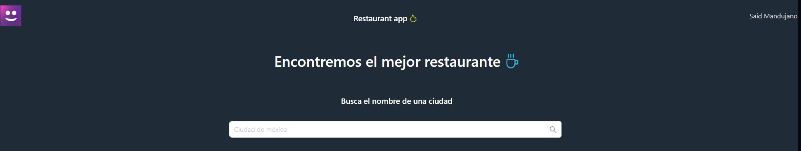

# Restaurant App

Este pequeño proyecto realiza la busqueda y recopilacion de datos de los mejores restaurantes en una ciudad dada mediante la tecnica web scraping de la plataforma "SECCION AMARARILLA".




## Frontend construido con 🔧
* React + TS
* Ant desing
* Axios


## Backend construido con 🔧
* Nodejs + TS
* Express
* Playwright


## Comenzando 🚀

Descarga los 2 proyecto.

### Pre-requisitos 📋
```
1. Node v19.0.0
```

## Instalación 🔧

Sigue los siguiente pasos para obtener una copia del proyecto y ejecutarla en entorno de desarrollo

* Clona el repositorio desde la linea de comandos o descargando el ZIP
```
$ git clone https://github.com/JILSE7/contentoh-challenge.git
```
* Instala los paquetes que necesita tanto el front como el back
```
$ cd front
  yarn install

$ cd back
  yarn install
```
* Ejecuta en ambas apps el comando para correr en modo desarrollo:
```
$ cd front
$ yarn dev

$ cd back
$ yarn dev
```
* Busca una ciudad para obtener sus resultados
* Se feliz :D


## Autores ✒️
* **Said Mandujano** - [JILSE7](https://github.com/JILSE7)

